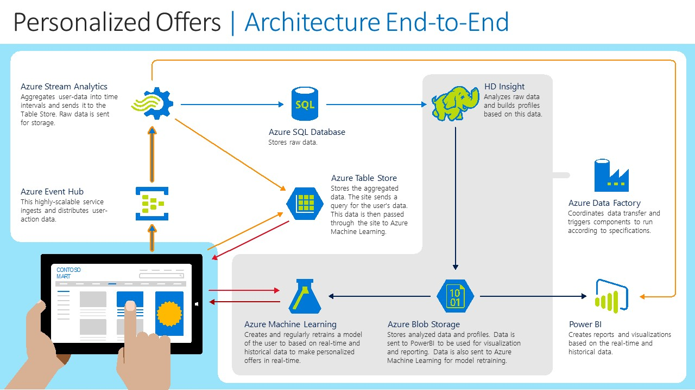

# Abstract #

This document explains how to build the Personalized Offers in Online Retail solution
piece by piece.
The manual process gives an implementer an inside 
view on how the solution is built, with an understanding of each of the components and how they are connected.

**For technical probems or questions about deploying this solution, please post in the issues tab of the repository.**

# Requirements
This section contains required accounts and software you will need to create this solution.

1. The full contents of this GitHub repository or the zipfile containing these files.
1. A network connection
1. A Microsoft Azure subscription (http://azure.microsoft.com). 
1. A Studio ML account (http://studio.azureml.net)
1. A Microsoft Office 365 subscription for Power BI access.
1. [SQL Server Management Studio](https://msdn.microsoft.com/en-us/library/mt238290.aspx ) or another similar 
tool to access a SQL server database.
1. [Microsoft Azure Storage Explorer](http://storageexplorer.com/)
1. [Power BI Desktop](https://powerbi.microsoft.com/en-us/desktop)

# Architecture
The image below shows the overall architecture of the Cortana Intelligence Suite 
Solution Package for the Personalized Offers in Online Retail store. This architecture provides an 
end-to-end pipeline to consume website traffic data to deliver real-time, personalized offers within the page. 

 

In this scenario, a website, such as our fictional *Contoso Mart*, tracks a user's browser history. This web traffic data is sent to an Event Hub which provides a highly scalable
data ingress service for consuming millions of events per second allowing us to scale this architecture to handle large
customer load. From event hub the data is passed into Stream Analytics to do the following:

1. Aggregate product views by user over the last 1 minute, 1 hour and 1 day and store the data in Azure Table Storage. 
1. Store the raw traffic data in an Azure Blob Container
1. The hot-path streaming data to Power BI requires the other two jobs. 

Every user's recent browser history is stored in table storage to provide low-latency, cost-effective access to the product
view counts. On every page request, the website will query Azure Table Storage to grab the current user's recent browser history
and feed this information into an Azure Machine Learning model via the Request-Response service. This machine learning model predicts 
the top 3 offers to provide the user based on their prior browser history. It is important to minimize the latency on these queries
to reduce the overall page load time for the user.

Lastly, an Azure Data Factory pipeline will take the raw web traffic stored in Blob Storage and copy the data to an Azure SQL Data
Warehouse for analytics and visualizations. This pipeline will run every 1 hour.

The end result of this solution is a functional end-to-end pipeline which allows a website owner to provide
more personalized offers to users based on their unique, recent browser history. Website owners can visualize the real-time
traffic and recommendations via Power BI leading to deeper insights.

For this package we have provided a Data Generator to simulate a retail website with Web Traffic & AML calls. 
In this solution, the website/data generator implements two key components:

1. Simulating website/product views sent by the website into our Event Hub.
1. Generating offers shown to users by calling Azure Machine Learning

# Setup Steps

The document walks the reader through the creation of many different Cortana Intelligence 
Suite services with the end result of replicating the architecture defined previously. 
As there are several services, it is suggested to group these services under a single [Azure 
Resource Group](https://azure.microsoft.com/en-us/documentation/articles/resource-group-overview/).

Similarly, we want to use a common name for the different services we are creating so that they can
be easily identified within your subscription. The remainder of this document will use the following
base service name:

***personaloffers[UI][N]***

Where ***[UI]*** is the user's initials and ***[N]*** is a random integer that you choose. 
Several services, such as Azure Storage, require a unique name across a region and hence this format 
should provide the user with a unique identifier. Characters must also be entered in in lowercase to 
accommodate for some restrictions on a few service names. 

For example, Steven X. Smith might use a base service name of *personalofferssxs01*. 

## 1.	Create a new Azure Resource Group
-	Navigate to ***portal.azure.com*** and log in to your account.
-	On the left tab click ***Resource Groups***
-	In the resource groups page that appears, click ***Add***
-	Provide a name ***personaloffers_resourcegroup***
-	Set the location to Central US
-	Click ***Create***

## 2.	Azure Storage Account
An [***Azure Storage***](https://azure.microsoft.com/en-us/services/storage/) account stores 
both the raw incoming web traffic data which is later consumed for batch processing as well as each 
user's recent product view counts which is used for the machine learning model. 

Below are the steps for provisioning your storage account:

-	Navigate to ***portal.azure.com*** and login in to your account.
-	On the left tab click **New -> Data and Storage -> Storage Account**
- 	Fill out the following configurations:
	-   ***Name***: personaloffers[UI][N]
	-	***Deployment model***: *Resource Manager*
	- 	***Account Kind***: *General Purpose* 
	- 	***Performance***: *Standard*
	-   ***Replication***:  *Locally-Redundant storage (LRS)*.
	-	***Resource Group***: Choose the resource group we created earlier, ***personaloffers_resourcegroup***
	-	***Location***: South Central US
-	Click ***Create***
-	Wait for the storage account to be created.

Now that the storage account has been created we need to collect the connection information so that we can
connect this account to other services like ***Azure Data Factory***. You can use the 
***ConnectionInformation.txt*** file to record this information for later use. The following
steps walk through how to grab the storage connection information:

-	Navigate to ***portal.azure.com*** and login in to your account.
-	On the left tab click ***Resource Groups***
-	Click on the resource group we created earlier ***personaloffers_resourcegroup*** 
-	Click on the storage account in Resources
-	In the *Settings* tab on the right click ***Access Keys***
-	Copy the ***storage account name*** and ***key1*** into the appropriate section of the ***ConnectoinInformation.txt*** file.
	These will be used to create the connection string to your storage account. 

 
### Prepare the storage account
In order for our solution to work, we will need to set-up the two *Blob Containers* and an *Azure Table* used in the solution

-	Download and install the [Microsoft Azure Storage Explorer](http://storageexplorer.com/)
-	Log in to your Microsoft account associated with your Azure Subscription
-	Locate the storage account created in step 2 and expand the nodes to see *Blob Containers*, etc.
-	You will need to repeat the following steps for the following two containers: *rawdata* and *scripts*
		1. Right click on ***Blob Containers*** and choose ***Create Blob Container***
		1. Enter the one of the container names, *rawdata* and *scripts*

- Next, we need to configure the Table storage which holds the user click history over the last day, hour and minute.
 This table is updated in real-time by our stream analytics job.
	1. Right click on ***Tables*** and choose ***Create Table***
	1. Enter the Table name *userdata*
	
You have now successfully configured your Azure Storage account.
		
## 3.	Azure Event Hub
Azure Event Hub is a highly scalable service that can ingest millions of records a second.
Event Hub will be the ingestion point for the web traffic data from your website (a data generator in this demo).
-	Navigate to ***portal.azure.com*** and login in to your account.
-	On the left tab click ***Resource Groups***
-	Click on the resource group we created earlier ***personaloffers_resourcegroup*** 
-	On the resource page click ***Add***
-	On the page that appears on the right, type Event Hub in the search box. 
-	Choose ***Event Hub***
-	Click ***Create*** on the page that comes up which will re-direct you to ***manage.windowsazure.com***.
-	On the redirected page Choose ***Custom Create***
- 	On the first page enter the following settings:
	-	***EVENT HUB NAME***: personaloffers[UI][N]
	-	***REGION***: Central US
	- 	***NAMESPACE***: in the drop-down menu choose ***Create new namespace***
	- 	***NAMESPACE NAME***: personaloffers[UI][N]-ns
	-	Click the right arrow button
- 	On page 2 enter the following settings:
	- ***PARTITION COUNT***: 8
	- ***RETENTION DAYS***: 7
	- Click the check button to complete the creation

We have now created the Azure Event Hub needed to receive website traffic data. The Event Hub will 
be consumed by Azure Stream Analytics. To ensure processing of the hub is successful 
we need to create [consumer groups](https://azure.microsoft.com/en-us/documentation/articles/event-hubs-programming-guide/#event-consumers) on the hub. 
For this solution we will need to create two different groups, *blobcg* and *pbicg*. 

-	Log into ***manage.windowsazure.com***
-	In the left panel, click ***SERVICE BUS***
-	In the list, choose the namespace we created above - personaloffers[UI][N]-ns
-	Click ***EVENT HUBS*** at the top of the right pane
-	The event hub we have created above (personaloffers[UI][N]) should be highlighted. 
-   In the bottom frame, click the ***CREATE CONSUMER GROUP*** and create the *blobcg* consumer group. 
Repeat this step to create the *pbicg* consumer group

Finally, we need to record the connection information for this event hub so that we can feed in
 event data from our data generator. While on the page for your service bus do the following: 

- 	Click the blue back arrow in the top left of the page to return to the ***SERVICE BUS*** page.
-	Highlight the namespace we created above (personaloffers[UI][N]-ns) by clicking on the row but do not open the namespace page.
-	At the bottom of the page click ***CONNECTION INFORMATION***
-	Copy the *CONNECTION STRING* information into the appropriate section in the ConnectionInformation.txt file.

## 4.	Azure Stream Analytics Jobs
[Azure Stream Analytics](https://azure.microsoft.com/en-us/services/stream-analytics/) allows you to 
create near real-time insights from devices, sensors, infrastructure and applications. 
For this demo Azure Stream Analytics is used to create three jobs that read web traffic data from the *Azure Event Hub*.
 
The first job, ***personaloffersasastorage*** directs all of the traffic data into our 
***Azure Blob Storage*** for later processing and generates the real-time product view counts stored
in ***Azure Table Storage***. This data is then used as an input to the machine learning model.

 The Power BI visualization requires two additional stream analytics jobs. The reason for this is that they 
 contain different forms of aggregation which cannot be combined into a single job. The first job,
 ***personaloffersasapbi1***, groups the traffic data over time while the second, ***personaloffersasapbi2***,
 provides the raw, un-aggregated data to Power BI. 
  
For each of these three jobs, complete the following steps:

-	Navigate to ***portal.azure.com and login*** in to your account.
-	On the left tab click ***Resource Groups***
-	Click on the resource group we created earlier ***personaloffers_resourcegroup*** 
-	On the resource page click ***Add***
-	On the page that appears on the right, type *Stream Analytics Job* in the search box. 
-	From the search results choose *Stream Analytics Job*
-	On the page that appears on the right click ***Create***
- 	Enter the following configurations:
	- ***Job Name***: Enter one of the 3 job names required (***personaloffersasastorage, personaloffersasapbi1, personaloffersasapbi2***)
	- ***Resource Group***:	Choose the resource group created earlier ***personaloffers_resourcegroup***
	- ***Location***: Central US
	-	Click ***Create***

After creating these jobs, they will need to be configured. While each stream will pull from the same input 
Event Hub, they will contain different [stream queries](https://msdn.microsoft.com/en-us/library/azure/dn834998.aspx) 
and different outputs. 

### Input configuration for the Stream Analytics jobs:
-	Navigate to ***portal.azure.com*** and login in to your account.
-	On the left tab click ***Resource Groups***
-	Click on the resource group we created earlier ***personaloffers_resourcegroup*** 
-	Click on the one of the Stream Analytics jobs that was created in the earlier steps.
-	Under ***Job Topology*** click ***INPUTS***
-	In the ***Inputs*** frame, Click ***ADD*** at the top
-	Enter the following inputs:
	- ***Input Alias***: inputeh
	- ***Source Type***: Data Stream
	- ***Source***: Event Hub
	- ***Service bus namespace***: Select the namespace you created above, personaloffers[UI][N]-ns
	- ***Event Hub Name***: Select the event hub you created above, personaloffers[UI][N]
	- ***Event hub consumer group***:
		- personaloffersasastorage uses *blobcg*
		- personaloffersasapbi1 uses *pbicg*
		- personaloffersasapbi2 uses *pbicg*
	- ***Event Serialization Format***: JSON
	- ***Encoding***: UTF-8
- Click ***Create***	

Now we will walk through setting up the queries and outputs for the three jobs.

### ***personaloffersasastorage*** Query and Output

####Configure the query:
- 	Navigate to ***portal.azure.com*** and login in to your account.
-	On the left tab click ***Resource Groups***
-	Click on the resource group we created earlier ***personaloffers_resourcegroup*** 
-	Click on the ***personaloffersasastorage*** Stream Analytics job
- 	Under ***Job Topology*** click ***Query***
- 	In the query box, copy the contents of the ***PersonalOffersASAStorage.txt*** located in under the ./ASA/ file path in the package.
- 	Click ***Save***

####Configure the output
There are four outputs from the personaloffersasastorage job. One to blob and three to table storage to handle minute, hour, and daily aggregate data. We will
walk through the configuration of all of these below:
- 	Return to the main frame for the personaloffersasastorage job
-	Under ***Job Topology*** click ***Outputs***
-	In the ***Outputs*** frame, Click ***ADD*** at the top
- 	Enter the following settings:
	- ***Output Alias***: OutputDayTablestore
	- ***Sink***: Table storage
	- ***Storage Account***: Select the storage account you created above, ***personaloffers[UI][N]***
	- ***Table name***: userdata
	- ***Partition key***: user_id
	- ***Row key***: product_period
	- ***Batch Size***: 1
- Click ***Create***. 
- Repeat the above steps twice more, the first time using the Output Alias OutputHourTablestore and the second time with the Output Alias OutputMinuteTablestore.

These create the outputs to table storage. We will now create the output to blob storage.

- 	In the ***Outputs*** frame, Click ***ADD*** at the top
-	Enter the following settings:
	- ***Output Alias***: OutputBlobStore
	- ***Sink***: Blob storage
	- ***Storage Account***: Select the storage account you created above, ***personaloffers[UI][N]***
	- ***Container***: rawdata
	- ***path pattern***: {date}/{time}
	- ***Date format***: YYYY/MM/DD
	- ***Time format***: HH
	- ***Event serialization format***: CSV
	- ***Delimiter***: comma (,)
- Click ***Create***. 

#### Start your stream analytics job
Now that this job has been configured, we can start the job to begin streaming data.
- 	return to the main frame for the job
- 	Click on the ***Start*** button at the top of the frame
-  	Choose ***Now*** as the start time. 

### ***personaloffersasapbi1*** Query and Output

####Configure the query:
- 	Navigate to ***portal.azure.com*** and login in to your account.
-	On the left tab click ***Resource Groups***
-	Click on the resource group we created earlier ***personaloffers_resourcegroup*** 
-	Click on the ***personaloffersasapbi1*** Stream Analytics job
- 	Under ***Job Topology*** click ***Query***
- 	In the query box, copy the contents of the ***PersonalOffersASAPBI1.txt*** located in under the ./ASA/ file path in the package.
- 	Click ***Save***

####Configure the output
The output of this job goes directly into Power BI. The following steps walkthrough the process
for setting up this functionality.

> NOTE: Stream analytics to Power BI functionality is configured on the ***manage.windowsazure.com*** portal

- 	Navigate to ***manage.windowsazure.com*** and login in to your account.
-	On the left tab click ***STREAM ANALYTICS***
-	Click on and open ***personaloffersasapbi1***.
-	At the top right of the page, click ***OUTPUTS***
-	Click ***ADD AN OUTPUT*** and fill in the following in the Wizard:
	- Page 1: Select ***Power BI***
	- Page 2: Click the *Authorize Now* button to link to your Office 365 subscription.
	- Page 3:
		- ***OUTPUT ALIAS***: OutputPBI
		- ***DATASET NAME***: PersonalOffersUserViews
		- ***TABLE NAME***: PersonalOffersUserViews
		- ***WORKSPACE***: My Workspace
	-	Click the check button at the bottom of the page to accept the new output.

#### Start your stream analytics job
Now that this job has been configured, we can start the job to begin streaming data.
- 	click ***START*** in the bottom frame of the Stream Analytics Job

### personaloffersasapbi2 Query and Output

####Configure the query:
- 	Navigate to ***portal.azure.com*** and login in to your account.
-	On the left tab click ***Resource Groups***
-	Click on the resource group we created earlier ***personaloffers_resourcegroup*** 
-	Click on the ***personaloffersasapbi2*** Stream Analytics job
- 	Under ***Job Topology*** click ***Query***
- 	In the query box, copy the contents of the ***PersonalOffersASAPBI2.txt*** located in under the ./ASA/ file path in the package.
- 	Click ***Save***

####Configure the output
The output of this job goes directly into Power BI. The following steps walkthrough the process
for setting up this functionality.
> NOTE: Stream analytics to Power BI functionality is configured on the ***manage.windowsazure.com*** portal

- 	Navigate to ***manage.windowsazure.com*** and login in to your account.
-	On the left tab click ***STREAM ANALYTICS***
-	Click on and open ***personaloffersasapbi2***.
-	At the top right of the page, click ***OUTPUTS***
-	Click ***ADD AN OUTPUT*** and fill in the following in the Wizard:
	- Page 1: Select ***Power BI***
	- Page 2: Click the *Authorize Now* button to link to your Office 365 subscription.
	- Page 3:
		- ***OUTPUT ALIAS***: OutputPBI
		- ***DATASET NAME***: PersonalOffersProductCount
		- ***TABLE NAME***: PersonalOffersProductCount
		- ***WORKSPACE***: My Workspace
	-	Click the check button at the bottom of the page to accept the new output.

#### Start your stream analytics job
Now that this job has been configured, we can start the job to begin streaming data.
- 	click ***START*** in the bottom frame of the Stream Analytics Job

We have now completed the Streaming Analytics set-up steps.

## 5.	Create Azure Studio ML Workspace and Experiment

The machine learning model for this solution is built using [Azure Machine learning](https://azure.microsoft.com/en-us/services/machine-learning/).
This section assumes that you have not set up any workspaces for Studio ML but that you do have an account at ***studio.azureml.net***.

The first thing we need to do is to create the workspace that will contain the experiment.

-	Navigate to ***manage.windowsazure.com*** and login in to your account.
-	On the left tab click ***MACHINE LEARNING***
-	In the bottom left hand corner click ***NEW***
-	Choose ***DATA SERVICES\MACHINE LEARNING\QUICK CREATE***
-	For workspace name enter *personaloffers[UI][N]*
-	Location South Central US
-	Choose the storage account created earlier
>***NOTE***: In some cases you cannot create a new Machine Learning Workspace in the same location as 
your storage account. If this is the case, you will need to create a second storage account. 
-	Click on ***Create an ML Workspace***

Now that we have a workspace in which to work, we can copy over the required experiment from the Gallery.

-	Navigate to ***studio.azureml.net*** and log into your account
-	Navigate to the experiment [Personalized Offers for Online Retail Recommendation Model](https://gallery.cortanaintelligence.com/Experiment/Personalized-Offers-for-Online-Retail-Recommendation-Model-v1-Predictive-Exp-1)

-	Click the ***Open in Studio button***. 
-	In the dialog Copy experiment from Gallery, choose South Central US and the workspace we created earlier that you would like to copy it into. Click the ***check*** button.
-	This process may take a minute, but the experiment will open in the requested workspace.
-	Click ***RUN*** at the bottom of the page. This step will take several minutes to finish and all objects in the graph will have a check box on them to indicate they have run.
-	Click ***DEPLOY WEB SERVICE [New]*** at the bottom of the page to create the Azure Web Service associated with the experiment.
-	Enter *personaloffers[UI][N]* as the Web Service Name.
-	Select *Create new...* for Price Plan
-	Enter *personaloffers[UI][N}]plan* as the Plan Name.
-	Click the ***Standard DevTest*** box to select it.  
-	Click the ***Deploy*** button.
-	When completed the browser will redirect to the web service home page.
	-	The web service home page can also be found by going to ***services.azureml.net*** page once logged in. 
-	Click ***Use Web Service***.
-	Copy the ***Primary key*** from the web service home page and paste it in the ***API Key*** section
in the ***ConnectionInformation.txt*** file. You will need this information later. 
-	Copy the ***Request-Response*** URI and add it to the ***ConnectionInformation.txt*** file as you will need this information later. Copy only the URI part https:.../execute ignoring the URI parameters starting with ? .

## 6.	Configure the data generator desktop application
Now that we have the event hub, stream analytics, and machine learning web service configured, 
we can configure the event generator and begin pushing data into our pipeline. 

-	Navigate to the hard disk location where the project was cloned or unzipped.
-	Go into the ***Data Generator*** directory and start the *Generatorw.exe* application.
	- Note that if you have File Name Extensions turned off (the default in Windows), the file *Generatorw.exe.config* will appear as *Generatorw.exe*.  In this case the correct executable file will appear as just *Gereratorw*.
-	In the left side of the application enter the event hub name, the event hub connection string, the AML endpoint URI, and the AML API key that were collected earlier.
-	Click the ***Save Configuration Changes*** button.
-	Click the green ***Start*** button.
-	The status area will change to green with the text *Running*
-	In the Events section at the top of the right hand side of the application you will see the count start to increment.

## 7.	Azure SQL Data Warehouse Setup
Now that we have completed the ingestion path, we can start building the data processing cold-path. In this solution,
we have a cold path which runs a batch process using ***Azure Data Factory*** to copy the raw user traffic data from blob to 
***Azure SQL Data Warehouse***. We will now walk through how to provision these features, starting with Azure SQL 
Data Warehouse.
-	Navigate to ***portal.azure.com*** and login in to your account.
-	On the left tab click ***New>Data and Storage>SQL Data Warehouse***
-	Enter the following configurations:
	- ***Database name***: personaloffers
	- ***Performance***: *choose the least expensive option*
	- ***Resource group***: personaloffers_resourcegroup
	- ***Select source***: Blank database
	- ***Server***:
		- Click ***Create a new server***
		- ***Server name***: personaloffers[UI][N]
		- Enter an admin login and password. Save the credentials in ***ConectionInformation.txt*** file for later use
		- ***Location***: Central US
		- Click ***Select***
	- Click ***Create*** to create the server.
	- Click ***Create*** again to create the SQL Data Warehouse.
-	Wait for the database and server to be created.
-	From ***portal.azure.com*** click on ***Resource Groups***  then the group for this demo ***personaloffers_resourcegroup***.
-	In the list of resources, click on the SQL Server  that was just created.
-	Under ***Settings*** for the new database, click ***Firewall*** and create a rule called ***open***
 with the IP range of 0.0.0.0 to 255.255.255.255. 
This will allow you to access the database from any computer. Click ***Save***.
 
>***NOTE:*** This firewall rule is not recommended for production level systems. This rule is for demonstration purposes
only. You will want to set this rule to the IP range of your secure system.

-	Launch ***SQL Server Management Studio***, or a similar tool, and connect to the database with the information you recorded in the table below.
	- If the tool you are using supports multiple server types, make sure you select *Database* or *Database Engine*.
	- The server name in most tools will require the full name: personaloffers[UI][N].database.windows.net,1433
	- Choose SQL Server Authentication
	- Enter the admin login and password you entered when creating the database server.
-	**THESE INSTRUCTIONS ARE FOR SSMS**
	-	Click on the database that you created on the server.
	-	Click ***New Query*** at the tool bar.
	-	Copy and execute the SQL script included in the package, ***CreateTableStatment.sql*** to create the 
	SQL table to store the output of the data copied by  ***Azure Data Factory***

## 8.	Azure Data Factory
We have now created the necessary components to put the data pipeline together using ***Azure Data Factory***. 
Data factory is an orchestration service that moves and processes data in a dependency flow pipeline.

For this solution we will require two pipelines. One pipeline is used to copy the raw website traffic from
blob storage to the ***Azure SQL Data Warehouse*** for later reporting in Power BI. A second pipeline is required for 
re-training our machine learning model. This pipeline makes use of an on demand ***HDInsight*** cluster to construct the necessary data tables 
for our machine learning model. 

This data factory will be scheduled to run every hour.
This means once the entire flow is configured and enabled results from this process will not be present 
until approximately 1.5 hours later.

Now it is time to create the data factory.

-	Navigate to ***portal.azure.com*** and login in to your account.
-	On the left tab click ***New>Data and Analytics>Data Factory***
- 	Fill in the following configurations:
	- 	***Name***: personaloffers[UI][N]
	- 	***Resource Group***: Choose the resource group created previously ***personaloffers_resourcegroup***
	-	***Location***: West US
-	Click ***Create***

The data factory will take some time to create. The portal page will direct you to the factory 
when it has been created, or you can access it through the *Resource groups* section.

Data factories are made up of several components:

-	***Linked services***: define the information for the data factory to connect to other services. 
-	***Datasets*** are named references used for input or output from an activity. 
-	***Pipelines*** contain one or more activities to be executed. 

To set up these components you will need to navigate to the author and deploy section of your
data factory. You can get here by following these steps:
-	Navigate to ***portal.azure.com*** and login in to your account.
-	On the left tab click ***Resource Groups***
-	Click on the resource group we created earlier ***personaloffers_resourcegroup*** 
-	Click on the ***personaloffers[UI][N]*** Azure Data Factory service
- 	Under the ***Actions*** section click on the ***Author and Deploy*** tile.

The following sections will walk you through setting up the specific linked services, datasets and pipelines used
in this solution.

### Linked Services
For this solution we are going to need 3 linked services. The JSON scripts referenced below for these linked services are stored
in ***ADF\1-LinkedServices***.

First, we will create the linked service for your storage account:
-	In the Author and Deploy frame of your Data Factory, click on ***New data store*** and select
***Azure Storage***
- 	Open the script ***storageLS.json***
- 	Replace the Storage Account Name and Account key in the file with the corresponding information recorded earlier in
the ***ConnectionInformation.txt*** file.
- 	Copy the contents from the modified file into the editor window
- 	Click ***Deploy***

Second, we create the linked service for the on-demand HDInsight
-	In the Author and Deploy frame of your Data Factory, click on ***... More***, then ***New Compute*** and select 
 	***On Demand HDInsight cluster*** 
-	Open script ***personaloffersHDInsightLS.json***
- 	Copy the contents of the file into the editor and click ***Deploy***
	 
Next, we create the linked service for the Azure SQL Data Warehouse
-	In the Author and Deploy frame of your Data Factory, click on ***New data store*** and select 
 	***Azure SQL Data Warehouse*** 
- 	Open the script ***personaloffersSQLDWLS.json***. 
-	Replace the server name, database, username and password with the information recorded earlier in the 
***ConnectionInformation.txt*** file
-	Copy the contents of the file into the editor and click ***Deploy***

### Datasets
For this solution we are going to need 2 data sets. The first is the Azure Blob storage data we will be copying and the 
second is the table in SQL Data Warehouse where the traffic data will be copied to. the JSON scripts for these datasets
referenced below are stored in ***ADF\2-Datasets****.

First, we need to create a dataset which defines the structure of the data stored in Azure Blob:
-	In the Author and Deploy frame of your Data Factory, click on ***... More***, then ***New dataset*** and select ***Azure Blob storage***
-	Copy the contents from the file ***personaloffersBlobInput.json*** into the editor window replacing the pre-filled text.
-	Click ***Deploy*** 

Second, we need to create a dataset which defines the table that the Data Factory to copy the web traffic data into.
-	In the Author and Deploy frame of your Data Factory, click on ***... More***, then ***New dataset*** and select ***Azure SQL Data Warehouse***
-	Copy the contents from the file ***personaloffersSQLDWOutput.json*** into the editor window replacing the pre-filled text.
-	Click ***Deploy*** 

 Datasets define the execution window of a pipeline. In the pipeline scripts under the availability section you will see that 
 frequency is set to hour and interval is set to 1. This means these data sets are available every 1 hours in the pipeline activity
  period so the pipeline will run every  hour. 

### Pipelines

For this solution we are going to need 1 pipeline to copy the raw web traffic data from stream analytics
to our SQL Data Warehouse. The JSON file for this pipeline is located in  ***ADF\3-Pipelines***

There are just a few modifications that these scripts will require. These modifications have to do with
 activity periods for the pipelines. An activity period describes the dates and times that the pipeline 
 should be executed. For a detailed discussion on activity periods click 
 [here](https://azure.microsoft.com/en-us/documentation/articles/data-factory-create-pipelines/).

At the bottom of each of the pipeline scripts there is a section that contains the following settings:

        "start": "[Start Activity Period UTC]",
        "end": "[End Activity Period UTC]", 

These fields identify when the pipeline should be active and are in UTC time.
 So, if you are in EST and you want to set this active from January 11th from 12:00 PM EST to 5:00 PM EST 
 you would modify these as follows:

        "start": "2016-01-11T17:00:00Z",
        "end": "2016-01-11T22:00:00Z", 

because of the five hour time difference between EST and UTC time.

When the pipelines are active you will incur some expense.

The following steps will deploy the pipeline within your Azure Data Factory:
In the Author and Deploy frame of your Data Factory, click on ***More commands*** and then ***New pipeline*** 
-	Copy the contents of the file into the editor.
-	Click ***Deploy***

Now the data factory is in place. You can see the layout of the factory by navigating to your data factory and 
clicking ***Diagram***. At the end of this document we have additional information about how you can validate that
the data factory is operating as expected. 

## 9.	Setting Up Power BI
Power BI is used to create visualizations for monitoring the live data stream (hot path) 
as well analysis of the web data over a longer period of time. (cold path).
 The final dashboard can be viewed via Power BI online. For this walkthrough we will provide instructions on how to set
 up your dashboard but will not walk through the steps for creating each individual visualization.

#### Cold Path & Power BI Desktop
-	Install the [Power BI Desktop application](https://powerbi.microsoft.com/en-us/desktop)
- 	For each of the PBIX files provided in ***/Power BI*** you will need to complete the following steps
	-	In Power BI Desktop, open the template PBIX file in the directory ***Power BI***
	-	On the application ribbon menu, choose *Edit Queries*
	-	Click *New Source* and select *SQL Server*.
	-	In the SQL Server Database dialog that appears enter in the name of the SQL server and database created earlier.  Leave the radio button on *Import*.
	-	Click ***OK***
	-	When prompted for credentials choose ***Database*** tab on the left and enter the user name and password for the SQL server created earlier.
	-	Click the *rawdata* table and then the *OK* button.
	-	Click *Close and Apply*.
	-	On the application ribbon menu click *Publish*, you will be prompted for your credentials.
	-	Navigate to ***msit.powerbi.com*** site, open the menu on the top left corner of the screen, navigate to Dashboards to see the dashboard that has been published. 

Users will need to customize the visualizations and analysis here to fit their specific business requirements. 

#### Hot path
The dashboard can further be customized to show the hot path, i.e. data that is coming from the stream analytics job. 
The data is available on the Power BI website under the Datasets section. They will appear with the names you configured
in your Stream Analytics jobs, ***PersonalOffersUserViews*** and ***PersonalOffersProductCount***.

## 10.	Getting it all running

All of the components and services that are needed for the demo are now in place. 
It is time to start up the system to have the data flow through the services and
 produce results for the Power BI dashboard!

This setup will also take care to limit the amount of time that the demo will run, and consequently,
reduce the cost to your subscription. It is up to the reader to determine if they want the system to run longer.

### Data Generator
Navigate to the package directory ***Personal Offers Data Generator*** and start the Generator.exe application. 
From previous steps in this document the application should already be configured to send messages to the event hub.
 Click the Start button to start feeding events to the event hub.

>|TIP|
|---|
|The data generator will only run when your laptop is on and has a network connection. It is possible when your laptop goes into "sleep" mode that the generator will stop running. To run this generator over a longer period of time it should be moved to an Azure Virtual Machine and executed there.| 

### Stream Analytics
The next thing to start is the stream analytics jobs.
-	Navigate to ***portal.azure.com*** and login in to your account.
-	On the left tab click ***Resource groups***
-	Click the resource group created earlier ***personaloffers_resourcegroup***
-	Click on each stream analytics job and on the pane that appears, click the ***Start*** button at the top of the page.

### Data Factory

The final step is to set an appropriate activity period for the data factory pipelines. 
This is simply to update the start and end timestamps for each pipeline as discussed in the Pipelines section.

-	Navigate to ***portal.azure.com*** and login in to your account.
-	On the left tab click ***Resource groups***
-	Click the resource group created earlier ***personaloffers_resourcegroup***
-	Click on the data factory in the resource group
-	Click ***Author and deploy***
-	Expand the *Pipelines* node
-	Modify each start and end with a time stamp starting at the current time and the end time for 6 hours later. 
-	Click ***Deploy***

Again, the activity period indicates how long the data factory will be in service. 
Limiting the timespan above to 6 hours will limit the expense to your subscription. 
However, is you do plan on deploying the generator to an Azure Virtual Machine to 
have a longer running demo, then adjust the activity period length accordingly. 

### Validation and Results

The Power BI dashboard initially has 12 values associated with it. These were placed into the
 database when we ran the script. Results from the pipeline will start to appear in just over 
 3 hours after starting the system up. You can ensure that the system is functioning as expected 
 by verifying there are more results in the database table. 

However, if the table is not receiving results in approximately 3.5 hours after starting the
 services you can take the following steps to see where the issue might be, but also consider 
 that the dashboards for the services update about every 15 minutes.

1.	Log into ***manage.windowsazure.com***
2.	Navigate to the event hub that was created and verify that it is receiving messages by viewing the dashboard.
3.	Navigate to the stream analytics jobs that were created and verify that it is processing messages by viewing the dashboard.
4.	Log into ***portal.azure.com***
5.	Navigate to the data factory created
6.	Navigate into the Datasets of the data factory and for each dataset view the Recently updated slices

In the case of steps 2 and 3 above, you look into the operations logs for those services to 
determine what errors, if any, have 

For case 6 it is expected that the first run of the pipeline will produce an error as there is no data 
to process when it is initially started. Later runs should run successfully and if not details of the 
failure can be determined by digging into the failed time slice.
 
### Monitoring services and checking the data flow

#### Checking for data in Azure Blob and Table Storage

#### Checking your Event Hub to validate that it is receiving messages 
While running the demo you can validate the event hub created is receiving messages by 
following the steps below. This can be a useful debugging step to determine if the event hub is 
functioning as expected, but note that the event hub will only show activity when the data 
generation tool is executing:
-	Log in to ***manage.windowsazure.com***
-	In the menu on the left side of the screen select ***SERVICE BUS***
-	Choose the service bus created above
-	Click on *EVENT HUBS* at the top of the right hand side of the page
-	Choose the event hub created above
-	The dashboard will show, with a 15-minute latency, the activity in the event hub. You can also gain more information on the event hub by selecting ***Operation Logs*** on the dashboard page under *Management Services*.

#### Checking Stream Analytics jobs
While running the demo you can validate the stream jobs are operating as expected by 
following the steps below. Please note that the event hub will only show activity when the data 
generation tool is executing:

-	Log in to ***manage.windowsazure.com***
-	In the menu on the left side of the screen select ***STREAM ANALYTICS***
-	Choose one of the stream jobs created above
-	Click on *DASHBOARD* at the top of the right hand side of the page
-	The dashboard will show, with a 15 minute latency, the activity in the event hub. You can 
also gain more information on the event hub by selecting ***Operation Logs*** on the dashboard page under Management Services.

#### Checking Azure Data Factory Pipelines
While running the demo you can validate that the data factory is operating as expected by following the steps below:

-	Log in to ***portal.azure.com***
-	In the menu on the left side of the screen select ***Resource groups***
-	Choose the previously created resource group ***personaloffers_resourcegroup***.
-	Click on the data factory that was created earlier. 
-	Click on the ***Monitor & Manage*** button and validate your credentials again if prompted.
-	If there are errors being reported, navigate back to portal.azure.com to the data factory and click on the datasets to determine where in the pipeline issues have been detected. 

#### Validating initial data generation
Leaving the generator running for about 15 minutes, we can validate that the services thus far are operating as expected. 

First validate event hub by following the steps in [help](#internaldoc). Check Event Hub. 

Next, validate that the stream analytics job related to storage is working by following the steps in [help](#internaldoc). Check Stream Jobs for the [help](#internaldoc) maintenancesa02asablob Output job. 

Finally, validate that the files are being created in the storage account by following these steps:

-	Open the Microsoft Azure Storage Explorer
-	Navigate to the storage account set up previously
-	Open the blob container maintenancesadata
-	Note that a sub folder *rawdata* has been created by the stream analytics job.

You may close the data generator as it is not required for the following steps. It will be needed later when the whole system is brought online after the remaining services have been configured.
